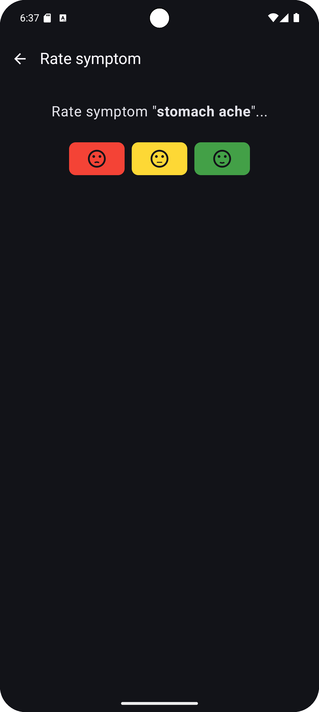

# TriggerTrace
Android app that helps you to recognize allergies or food intolerances.

Track food intake and symptoms.

Save the foods you have eaten and the symptoms you have experienced.

Export the data as SQLite or CSV.

Currently in development.
